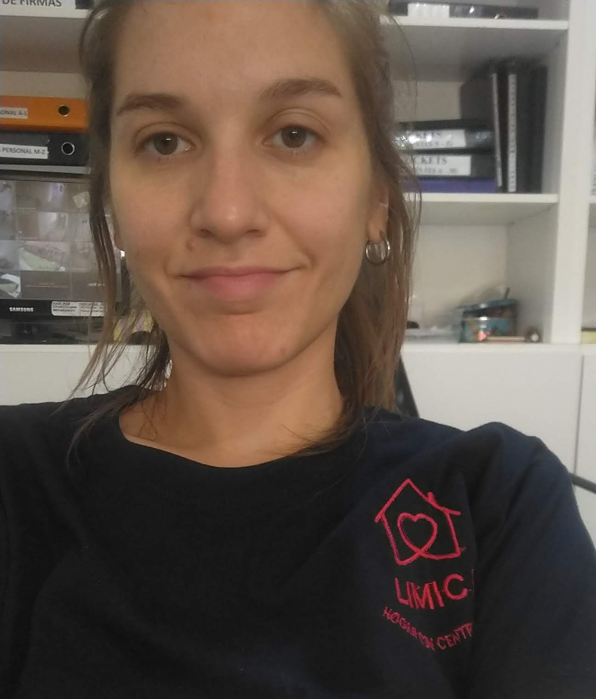

Hola, soy
#MARIANA LUCÍA ALPERN y soy estudiante de la tecnicatura
en programación desde el 2021. 
```
"LA TERCERA ES LA VENCIDA"
dijo alguien alguna vez.
```
Esta, es la tercera vez que me anoto 
en #objetos 1. La primera vez, arranqué
pero no me pude acomodar. Justo me había mudado,
arrancado un laburo nuevo + maternidad. La dejé casi al
principio. La segunda vez (cuatri pasado), llegué a ver
todos los temas pero no me fue muy bien en el parcial, 
podría haber recuperado pero preferí recursarla.
Con respecto al trabajo en grupo no pude participar directamente
porque no me dió el tiempo! Otra razón más para recursar.
Este cuatri lo lograré?
:rofl:

## Les dejo este dato curioso :monocle_face:
- [x] [DATO CURSIOSO](https://billiken.lat/interesante/cual-es-el-origen-de-la-frase-la-tercera-es-la-vencida/)

#BUENA CURSADA PARA TOD@S!